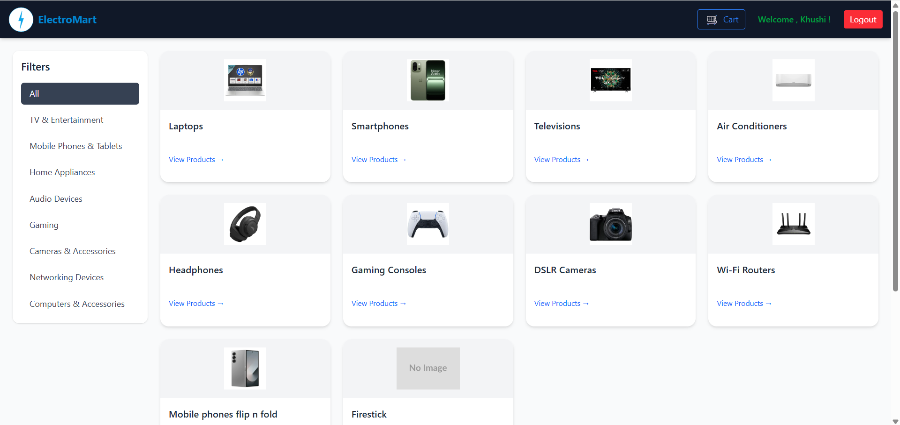

# ⚡️ ElectroMart – Electronics E-Commerce Platform

**ElectroMart** is a modern full-stack e-commerce platform built for electronics retail and B2B bulk purchases. Built using **React, Node.js, Express, and MongoDB**, it provides a seamless experience for both customers and administrators, including cart management, secure checkout, email order confirmations, invoice sending, and bulk enquiry handling with email communication.

---

## 🚀 Key Features

### 🛒 Customer Side
- 🧭 Navigate through categories and products
- 🔍 View detailed product pages
- ➕ Add products to cart and update quantity
- 💳 Secure checkout and order placement
- 📩 Email confirmation with attached invoice (PDF)
- 🧾 Order history and status tracking
- 📬 B2B Bulk Enquiry Form – sends enquiry to admin via email

### 🧑‍💼 Admin Panel
- 🔐 Admin Login
- 📊 Dashboard with metrics and summaries
- 🔧 CRUD operations:
  - 📦 Manage Products
  - 🗂️ Manage Categories
  - 📜 Manage Orders
  - 📥 View and respond to Bulk Enquiries
- 📧 Send email quotations to bulk customers directly

---

## 📧 Email Functionality

- **Order Confirmation Emails:**  
  After placing an order, customers receive a confirmation email with order details and an attached invoice PDF.

- **Bulk Order Enquiry Emails:**  
  B2B customers can fill out a bulk order enquiry form. The system sends the enquiry details directly to the admin’s dashboard.

- **Admin Quotation Response:**  
  Admin can respond to enquiries with custom pricing or downloadable quotations via email.

---

